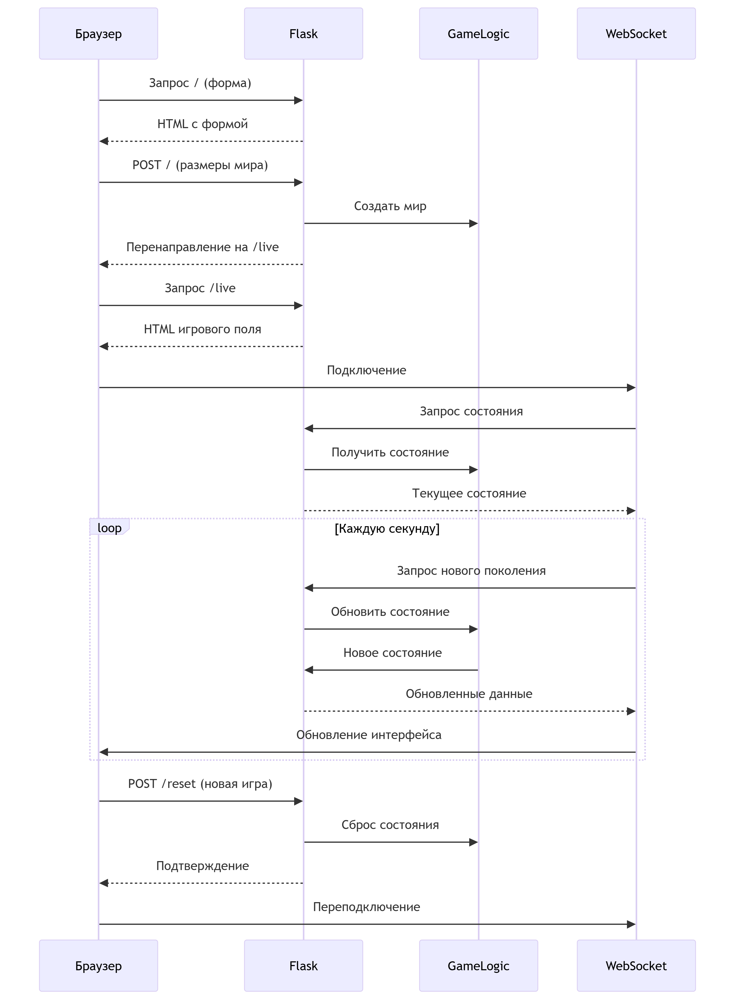

# Conway's Game of Life

Учебный проект Flask, реализующий клеточный автомат "Игра Жизнь" с динамическим обновлением через WebSockets

## Особенности реализации
- Динамическое обновление игрового поля без перезагрузки страницы
- Пользовательский размер игрового мира (10-20 клеток)
- Определение различных условий окончания игры:
  - Все клетки вымерли
  - Мир стабилизировался
  - Обнаружены осцилляторы (периодические паттерны)
  - Достигнуто максимальное число поколений (100)
- Визуальное выделение:
  - Живых клеток (зеленый)
  - Недавно умерших клеток (красный)
- Возможность перезапуска игры без перезагрузки страницы

## Запуск проекта

1. Создайте виртуальное окружение:
   ```bash
   python -m venv .venv
   ```

2. Активируйте окружение:
   ```bash
   # Windows
   .venv\Scripts\activate
   
   # macOS/Linux
   source .venv/bin/activate
   ```

3. Установите зависимости:
   ```bash
   pip install -r requirements.txt
   ```

4. Запустите приложение:
   ```bash
   flask run
   ```

5. Откройте в браузере: http://127.0.0.1:5000

## Структура проекта
├── .gitignore
├── README.md        # Этот файл
├── app.py           # Главный файл приложения (роутинг, WebSocket)
├── game_of_life.py  # Логика игры (Conway's Game of Life)
├── requirements.txt # Зависимости
├── static/
│   └── css/
│       └── style.css # Стили и анимации
├── templates/       # HTML-шаблоны
│   ├── base.html    # Базовый шаблон
│   ├── index.html   # Главная страница (форма создания мира)
│   └── live.html    # Игровое поле (динамическое обновление)
└── docs/
    └── architecture.png
    
## Технологии
- Python 3.12
- Flask 3.1
- Flask-SocketIO 5.3.6
- HTML5/CSS3 (адаптивная верстка)
- JavaScript (jQuery, Socket.IO)

Как играть
На главной странице задайте размеры мира (от 10x10 до 20x20 клеток)
Нажмите "Создать жизнь" - система сгенерирует случайный мир
Наблюдайте за развитием клеточной вселенной в реальном времени
Когда игра завершится:
Нажмите "Новая игра" для генерации нового мира
Или "На главную страницу" чтобы изменить размеры мира

Архитектура решения


API Endpoints
GET / - Главная страница с формой
POST / - Создание нового мира
GET /live - Страница игрового поля
POST /reset - Сброс игры
WebSocket /socket.io - Реальное обновление состояния

Особенности реализации
Синглтон-паттерн - гарантирует единое состояние игры
Торическая геометрия - мир "зациклен" по краям
Оптимизированные проверки - быстрая обработка больших миров
CSS-анимации - плавные переходы состояний клеток


[🎮 Game of Life on Flask](https://github.com/user-aefimov/game_life) 